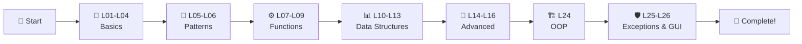

<div align="center">
<h1>Java Complete Course</h1>
    


### 🎓 Complete Java Programming Course

**From Zero to Hero - All Lessons Completed**

[⭐ Star this Repo](https://github.com/ktirumalaachari/Java-Complete-Course) • [📝 Report Issue](https://github.com/ktirumalaachari/issues)

</div>

---

## 📌 About This Repository

This repository contains a **complete Java programming course** following the **Apna College curriculum**. All lessons from fundamentals to advanced topics have been successfully completed with hands-on code examples and practice problems.

**Perfect for:**

- 🎯 Learning Java from scratch
- 📚 Comprehensive reference material
- 💡 Understanding OOP concepts
- 🚀 Building strong programming fundamentals

---

## 🎯 Course Content Overview

### 🔰 Core Fundamentals

| Lesson  | Topic                        | Files             | Status |
| ------- | ---------------------------- | ----------------- | ------ |
| **L00** | Revision & Practice          | 8+ files          | ✅     |
| **L01** | Introduction to Java         | `firstclass.java` | ✅     |
| **L02** | Variables & I/O              | 5 files           | ✅     |
| **L03** | Conditional Statements       | 4 files           | ✅     |
| **L04** | Loops (for, while, do-while) | 5 files           | ✅     |

### 🎨 Pattern Programming

| Lesson  | Topic                | Patterns   | Status |
| ------- | -------------------- | ---------- | ------ |
| **L05** | Basic Shape Patterns | 9 patterns | ✅     |
| **L06** | Advanced Shapes      | 5 patterns | ✅     |

### ⚙️ Functions & Algorithms

| Lesson  | Topic                   | Content            | Status |
| ------- | ----------------------- | ------------------ | ------ |
| **L07** | Functions & Methods     | Intro + 3 problems | ✅     |
| **L08** | Practice Questions      | 10 problems        | ✅     |
| **L09** | Time & Space Complexity | Algorithm analysis | ✅     |

### 📊 Data Structures

| Lesson  | Topic              | Files             | Status |
| ------- | ------------------ | ----------------- | ------ |
| **L10** | Arrays (1D)        | 2 files           | ✅     |
| **L11** | 2D Arrays & Matrix | Search algorithms | ✅     |
| **L12** | Strings            | 4 files           | ✅     |
| **L13** | StringBuilder      | 2 files           | ✅     |

### 🔧 Advanced Concepts

| Lesson  | Topic                | Content                      | Status |
| ------- | -------------------- | ---------------------------- | ------ |
| **L14** | Operators & Keywords | Comprehensive guide          | ✅     |
| **L15** | Bit Manipulation     | Set, Clear, Update           | ✅     |
| **L16** | Sorting Algorithms   | Bubble, Selection, Insertion | ✅     |

### 🏗️ Object-Oriented Programming

| Lesson  | Topic        | Content                                                           | Status |
| ------- | ------------ | ----------------------------------------------------------------- | ------ |
| **L24** | Complete OOP | Classes, Inheritance, Interfaces, Abstract, Static, Encapsulation | ✅     |

### 🛡️ Exception Handling & GUI

| Lesson  | Topic              | Content                                              | Status |
| ------- | ------------------ | ---------------------------------------------------- | ------ |
| **L25** | Exception Handling | Try-Catch, Throws, Custom Exceptions, Multithreading | ✅     |
| **L26** | AWT & GUI          | GUI Programming                                      | ✅     |

---

## 🚀 Quick Start

### Prerequisites

```bash
✅ Java JDK 8 or higher
✅ Any IDE (VS Code / IntelliJ IDEA / Eclipse)
✅ Basic programming knowledge
```

### Installation & Usage

```bash
# Clone the repository
git clone https://github.com/ktirumalaachari/Java-Complete-Course.git

# Navigate to the folder
cd "Java-Complete-Course"

# Choose any lesson (example: L10 Array)
cd "L10 Array"

# Compile and run
javac filename.java
java filename
```

---

## 📂 Repository Structure

```
📦 Java Complete Course
├── 📁 L00 Revision
│   ├── Command Line Arguments
│   ├── Constructor Overloading
│   ├── Method Overloading
│   ├── This Keyword & Wrapper Classes
│   └── 📁 Sub-topics (Control Statements, Arrays, Strings, Operators)
├── 📁 L01-L04 → Java Basics (Variables, Conditions, Loops)
├── 📁 L05-L06 → Pattern Programming (14 Patterns)
├── 📁 L07-L09 → Functions & Complexity
├── 📁 L10-L13 → Data Structures (Arrays, Strings)
├── 📁 L14-L16 → Bit Manipulation & Sorting
├── 📁 L24 → Object-Oriented Programming (Complete)
├── 📁 L25 → Exception Handling & Multithreading
└── 📁 L26 → GUI with AWT
```

---

## 💡 Key Learning Highlights

### 🎯 What's Covered

✨ **Core Java Concepts**

- Variables, Data Types, Type Casting
- Control Flow (if-else, switch, loops)
- Arrays (1D & 2D)
- String manipulation & StringBuilder

🔥 **Advanced Topics**

- Time & Space Complexity Analysis
- Bit Manipulation Techniques
- Sorting Algorithms Implementation
- Exception Handling Mechanisms

🏆 **Object-Oriented Programming**

- Classes & Objects
- Inheritance (Single, Multilevel, Hierarchical)
- Interfaces & Abstract Classes
- Encapsulation & Access Modifiers
- Static Keyword Usage

🚀 **Practical Skills**

- 14+ Pattern Programming Problems
- 10+ Function Practice Questions
- Real-world coding examples
- GUI Development with AWT

---

## 🎓 Learning Path



---

## 🤝 Contributing

Contributions are welcome! Here's how you can help:

1. 🍴 Fork the repository
2. 🌿 Create a feature branch (`git checkout -b feature/AmazingFeature`)
3. ✍️ Commit your changes (`git commit -m 'Add some feature'`)
4. 📤 Push to the branch (`git push origin feature/AmazingFeature`)
5. 🔃 Open a Pull Request

**Contribution Ideas:**

- 🐛 Fix bugs or typos
- ✨ Add more practice problems
- 📝 Improve documentation
- 💡 Share alternative solutions

---

## 📚 Useful Resources

### Official Documentation

- [☕ Oracle Java Docs](https://docs.oracle.com/javase/tutorial/)
- [📖 Java SE API](https://docs.oracle.com/en/java/javase/17/docs/api/)

### Learning Platforms

- [🎥 Apna College](https://www.youtube.com/@ApnaCollegeOfficial)
- [💻 GeeksforGeeks](https://www.geeksforgeeks.org/java/)
- [📚 W3Schools Java](https://www.w3schools.com/java/)

### Practice Coding

- [🎯 LeetCode](https://leetcode.com/)
- [💪 HackerRank](https://www.hackerrank.com/domains/java)
- [🏆 CodeChef](https://www.codechef.com/)

---

## 📄 License

This project is licensed under the **MIT License** - feel free to use for learning and teaching!

[](LICENSE)

---

## 🌟 Show Your Support

If this repository helped you learn Java:

⭐ **Star** this repository
🍴 **Fork** for your reference
📢 **Share** with fellow learners
🤝 **Contribute** to improve it

---

## 👨‍💻 Author

**K Tirumala Achari**  
Full Stack Developer

[](https://github.com/ktirumalaachari)
[](https://ktirumalaachari.vercel.app/)
[](ktirumalaachari@gmail.com)
[](https://www.nist.edu/)

 <div align="center">

### 🎉 Course Completed Successfully! 🎉

**Made with ❤️ and ☕ by [K Tirumala Achari](https://github.com/ktirumalaachari)**

_Happy Coding! Keep Learning, Keep Growing!_ 💻✨

**⭐ If this helped you, please star this repository! ⭐**

</div>
